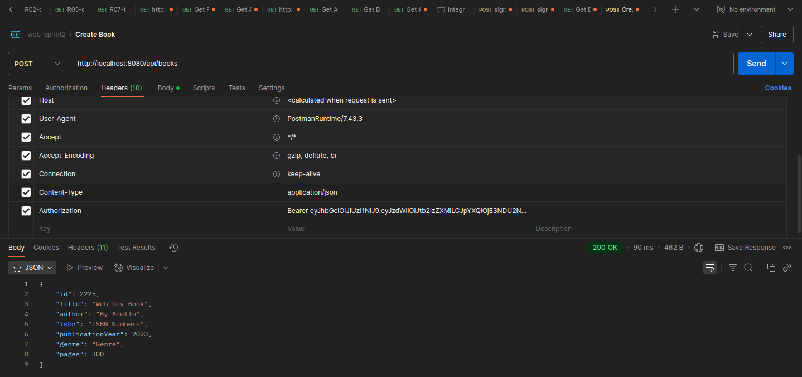

# **Java - MultiThread Exercise**

# **Advanced Web Sprint 2**

## Equipo #46

Carlos Iván Armenta Naranjo - A01643070

Jorge Javier Blásquez Gonzalez - A01637706 

Adolfo Hernández Signoret - A01637184

Arturo Ramos Martínez - A01643269

Moisés Adrián Cortés Ramos - A01642492

Bryan Ithan Landín Lara - A01636271

## To run use:
```
git clone --branch sprint2 --single-branch https://github.com/Sign0ret/LibraryApi
```
```
cd LibraryApi/LibraryManagement
```
```
mvn clean install
```
```
mvn spring-boot: run
```

## For the swagger documentation go to:

http://localhost:8080/swagger-ui/index.html

## See proof of our working endpoints:
#### Signup with valid credentials

#### Signin with valid credentials

#### Get All Books with valid token in header

#### Get book by id without token in header

#### Get book by id with valid token in header

#### Post book without valid token in header

#### Post book with valid token in header

#### Delete book with valid token in header
